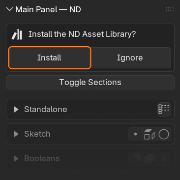

# ND Asset Library

**From Version 2.0 onwards**, ND comes with an additional Asset Library containing powerful Geometry Nodes (GN) driven generators, operators, and selectors. A set of prefabricated (prefab) objects is also included to boost your workflow, and to demonstrate the use of the GN powered assets. These are available from the Asset Library window within Blender, and are organised in a catalog called 'ND'.

!> **Compatibility:** Blender 4.5 and above.

## Installation

The Asset Library is an optional one-click install, available from the 3D viewport sidebar (aka N-Panel), and can also be managed/uninstalled from **_`Edit > Preferences > File Paths`_**.

?> **Manual installation:** the asset library file, `nd_asset_library.blend`, is located in the `assets` directory within the ND add‑on folder. You may copy or move this file to another location on your hard drive and add its path in Blender’s preferences. If you want to use the built‑in categories, also copy the `blender_assets.cats.txt` file alongside it.

## Concepts

Blender's built-in modifiers offer powerful non-destructive operations to be applied to an object. ND add-on then helps orchestrate the use of modifiers to make a non-destructive modeling workflow easier and more efficient.

The ND Asset Library further extends this functionality with custom GN powered modifiers, introducing new non-destructive capabilities to Blender:

- **Generators** output new non-destructive geometry, such as `ND.Polygon`, when applied to an existing mesh primitive object (whose geometry is ignored).
- **Operators** take input geometry and modify it non-destructively, such as `ND.Extrude`.
- **Selectors** take input geometry and filter mesh elements (verts, edges, faces) to form a _selection_, such as `ND.Select.VertsByNeighbors`, which is then stored as a _named attribute_ to be accessed in a later operation.

Just like built-in modifiers, these are accessed via an object's modifier stack. However, the ND Asset Library introduces a new paradigm allowing you to maintain **Reference geometry** alongside **Working geometry**. This enables you to work on the result of the last modifier (the working geometry) just like a regular built-in modifier, or optionally work on preserved geometry from earlier in the stack (as reference geometry). We refer to **Input geometry** as the combination of _Working_ and _Reference_ geometry.

You can find these options in the **Advanced** panel of each modifier.

!> **Important:** The ND reference paradigm only works for ND modifiers. Blender's built-in modifiers have no concept of _context_ so will always use all input geometry and cannot tell the difference between _working_ and _reference_ geometry.

## Usage

**Generators, Operators, and Selectors** must be dragged from the Asset Browser window onto a mesh primitive object (target) in the 3D Viewport. Where applicable, 3D Viewport gizmos allow for quick manipulation of key parameters. Opening the modifier stack of the target object will reveal the GN powered modifier, with parameters available to control specific behaviour.

**Prefab** assets, such as `ND.Primitive.Cube` or `ND.Pipe.Simple` can be dragged from the Blender Asset Browser window directly into the 3D Viewport.

?> **Note:** ND Asset Library uses the _Append (Reuse Data)_ Import Method. This is the recommended approach because it _appends_ assets as a new data-block instead of creating a _linked data-block_ that would form a  dependency on the asset library always being available in future. The 'Reuse Data' option ensures the underlying GN data-blocks are not unnecessarily duplicated within the file, keeping things streamlined. You can change this in **_`Edit > Preferences > File Paths`_** to suit your particular workflow needs.