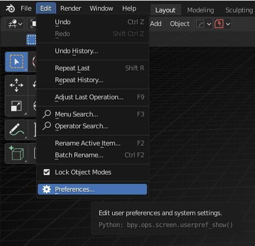
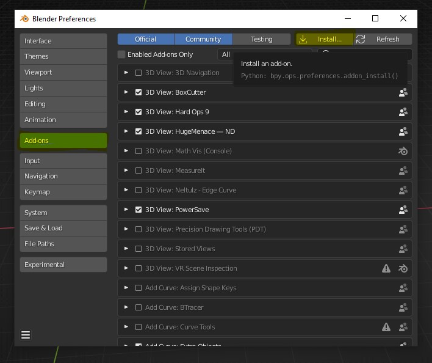
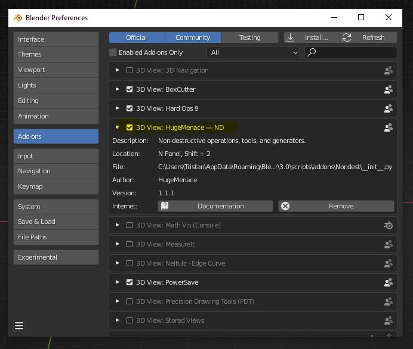

# Installation

Installation is straight forward. Download the latest version of ND from wherever you purchased it (Gumroad, Blender Market, etc.) and note the location of the zip file. The zip file will be prefixed with `nd`, followed by the version number, eg: `nd-1.0.0.zip`

Open Blender, and from the main menu click on **Edit > Preferences**

From the preferences window, click on the **"Add-ons"** tab, and then click on the **"Install..."** button.

This will bring up a file browser window. Find the zip file you downloaded and select it. Once selected, you should now see an addon labeled **"3D View: HugeMenace — ND"**. If you don't see it, you can simply search for it using the search box located right below the **"Install..."** button. 

All that's left to do is click the little checkbox next to the addon label and you're ready to go!

