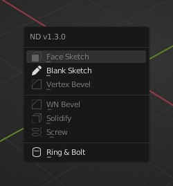
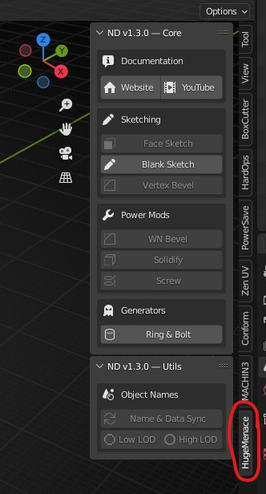
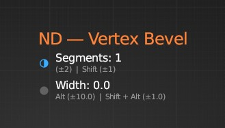

# Introduction to ND

**Where to find it**

ND can be found in 2 places, first via the shortcut menu (default keybind is Shift + 2):

and secondly via the N / UI panel next to your other favourite add-ons:

**Overlay/parameter options**

Whenever you use an interactive ND tool, an overlay appears in the 3D view that follows your cursor.

The active and adjustable parameter will have a blue dot to the left of it's name. A solid blue dot means it's in regular mode, and the half-moon dot means it's alternative mode. Alternative mode is activated by holding down the **Shift** key, alonside the parameter activation key (**Ctrl, Alt, Ctrl + Alt**). Usually the alternative mode is simply a smaller step size (similar to what the shift key does in Blender).

To change parameter values, you use your **mouse wheel** (scroll up and down).

To change the step size for most parameters (parameters are denoted with ±), hit **numpad +** or **numpad -** (you can also hit the standard **+** and **-** keys if you don't have a numpad.)

To disable the overlay from following your cursor, hit the **P** key to pin the overlay to the bottom right of the 3D viewport. Hitting **P** again will unpin the overlay.
