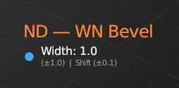
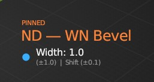
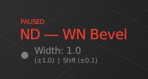
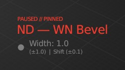
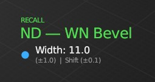
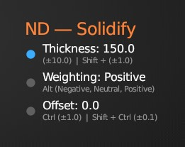
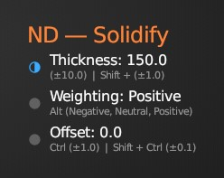
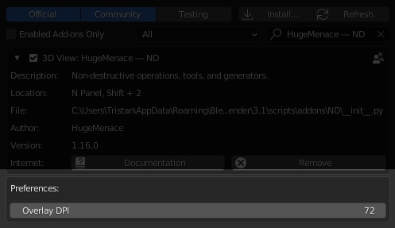

# Introduction to ND

ND (short for non-destructive) is a Blender addon that provides a number of workflow enhancements, tools, operations, and generators — tailored specifically for non-destructive modelling. 

This approach is useful for many types of modelling needs, particularly hard-surface forms, while being able to quickly adjust parameters without the need for manual poly-modelling. ND makes extensive use of modifiers to enable this flexible workflow.

?> **Note**: The ND addon is under active development, so features or functionality shown in the video below may differ from the current latest version. Check the YouTube channel for updates, or read through the written documentation. We'll endeavour to keep the documentation and videos up to date as we progress 🚀

    <iframe style="position: absolute; top: 0; right: 0; bottom: 0; left: 0; width: 100% !important; height: 100% !important; margin: 0 !important;" src="https://www.youtube.com/embed/CiaeUR0tBnU?modestbranding=1&rel=0" title="YouTube video player" frameborder="0" allow="accelerometer; autoplay; clipboard-write; encrypted-media; gyroscope; picture-in-picture" allowfullscreen></iframe>

## How to open it

ND can be accessed in 2 primary ways, via the **N** panel, located under the **HugeMenace** tab — or via the shortcut menu bound to **SHIFT + 2** (you can change this under _Edit > Preferences > Addons > 3D View: HugeMenace — ND > Keymap_).

## How to use it

The ND addon works in different Blender modes (object & edit) and changes behaviour depending on how many objects you have selected. At any point, you can open the N panel UI or the menu and see which operators are available given your current context (operators which cannot be used will be disabled automatically).

For operators that work interactively, an overlay will appear next to and follow the mouse cursor. If you would like to **pin** the overlay in place, you can hit **P** key _(can be customised in preferences)_. Each press will toggle pinning on/off. 

Overlay's have a special **Pause** mode which can be toggled by hitting the backslash key **\** _(can be customised in preferences)_. This will pause the operator and allow you to perform other actions in Blender.

Certain operators (those with [R] next to their name in the docs) can be **Recalled**. When an operator is recalled, the current modifier settings used by the object be automatically loaded into the overlay, so you can continue where you left off or adjust the previous operation.

In some situations the overlay can be in multiple states, for example, both pinned & paused.

### Overlay states

| Overlay State | Description |
| :------------ | :----------- |
|  | The standard overlay state. |
|  | The pinned overlay state. |
|  | The paused overlay state. |
|  | The paused & pinned overlay state. |
|  | The recalled overlay state. |

## Operator options

Most operators while in an interactive mode will have one or more options. These are shown in the overlay prefixed with a grey dot. The current active option is always prefixed with a blue dot.

When pressing and holding the modifier key shown under any option, the option will be activated and the blue dot will be shown next to it. When the modifier key is released, the option will be deactivated and the blue dot will be hidden.

?> **Important:** To change an option's current value, simply use your **mouse scroll wheel** (scroll up to increase and down to decrease). In addition, you can also use the **arrow or WASD** keys; **W/D/Up/Right** will increase the current value, and **S/A/Down/Left** will decrease it.

?> **🎉 NEW**: If you enable "Mouse Values" in the addon preferences, you can move your mouse left and right to change any option that has 2 little chevrons to the left of it. See an example overlay below. If you find the values change too drastically while using your mouse, you can adjust the overall sensitivity in the preferences (under "Mouse Value Scalar".)

Many operator options have a _precision_ mode which can be activated by holding down the **SHIFT** key. You'll know when an active option is in this mode as the option's blue dot will be half-filled.

?> For certain options, the step size can be altered by hitting the plus and minus keys on the numpad or the keyboard.

| Overlay Option | Description |
| :------------ | :----------- |
|  | An overlay with multiple options. The active option is shown by a blue dot. |
|  | An overlay with the active option in _precision_ mode. |

## Adjusting the overlay

If the overlay text is to small to read on your monitor (for instance you're using a 4K resolution) - you can increase the size by adjusting the _Overlay DPI_ in the addon preferences.

