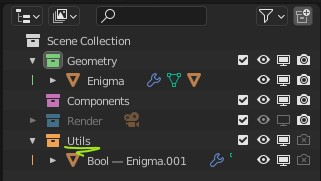
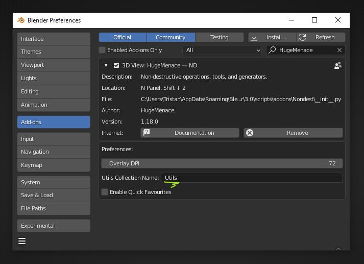

# Utils Collection

"Utils" is a specific ND collection where operators that produce or work with objects will place boolean references, cutters, and circular array rotators (empties) so that they do not clutter the scene or interfere with further modelling operations.

By default, this collection will be called "Utils" and have an orange collection icon. If you'd like to use a different collection name, you can rename it in the addon preferences:

