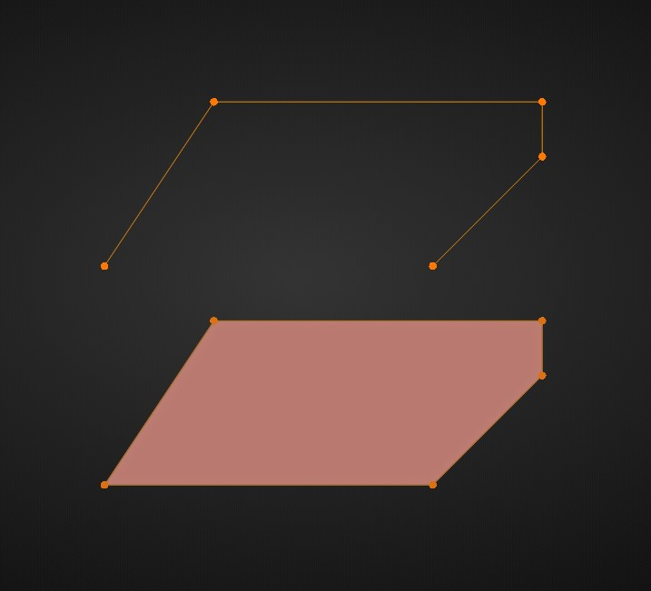

# Make Manifold

The Make Manifold operator will take any open-loop (unclosed) sketch and ensure that it is manifold. This means that the first and last vertices (under normal conditions) will be connected, all overlapping vertices and edges will be removed, and faces will be filled in.

See the image below showing the before (top) and after (bottom) versions of the same sketch.

