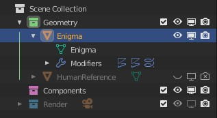
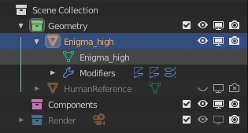

# High & Low LOD

The High & Low LOD operator will suffix objects and their corresponding mesh names with `_high` and `_low` respectively.

Example, here is an object named `Enigma`:

After selecting the object and running the High LOD operator, the object and mesh names will be suffixed with `_high`:

?> **Tip:** this operator is useful for when you're creating a high and low poly version of your model for use in baking and texturing tools such as Marmoset Toolbag & Substance Painter.