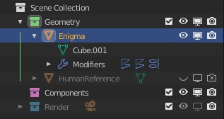
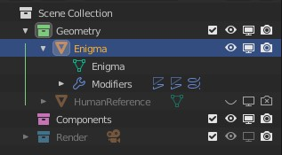

# Name & Data Sync

The Name & Data Sync operator will synchronize mesh names with their corresponding object names.

For example, take this object name `Enigma` which has a mesh named `Cube.001`:

After selecting the object and running the Name & Data Sync operator, the mesh name will be updated to match the object name `Enigma`:

?> **Tip:** this operator is useful for keeping your object & mesh names consistent throughout your scene, without the need for manual or batch renaming operations.